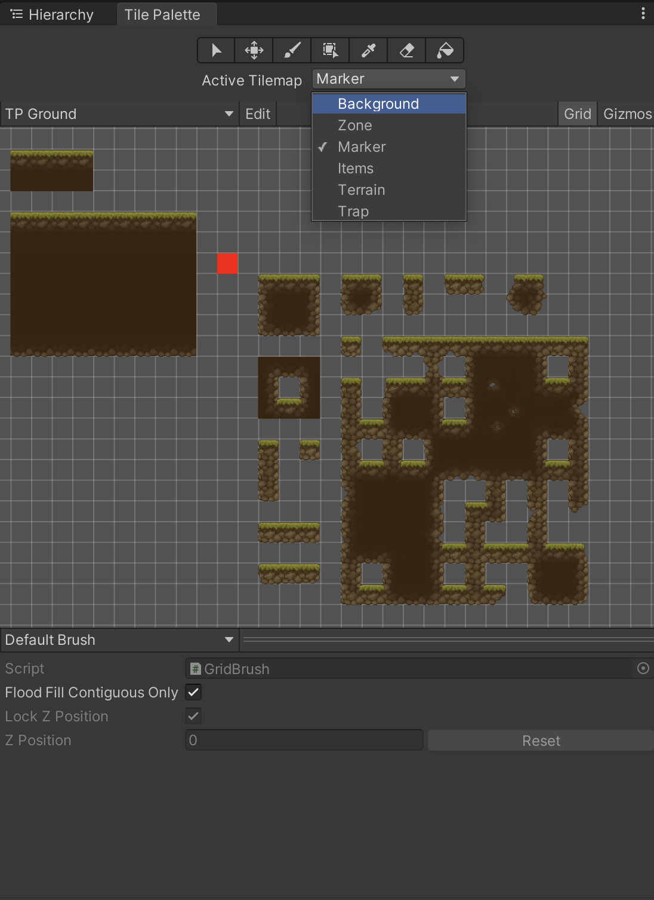
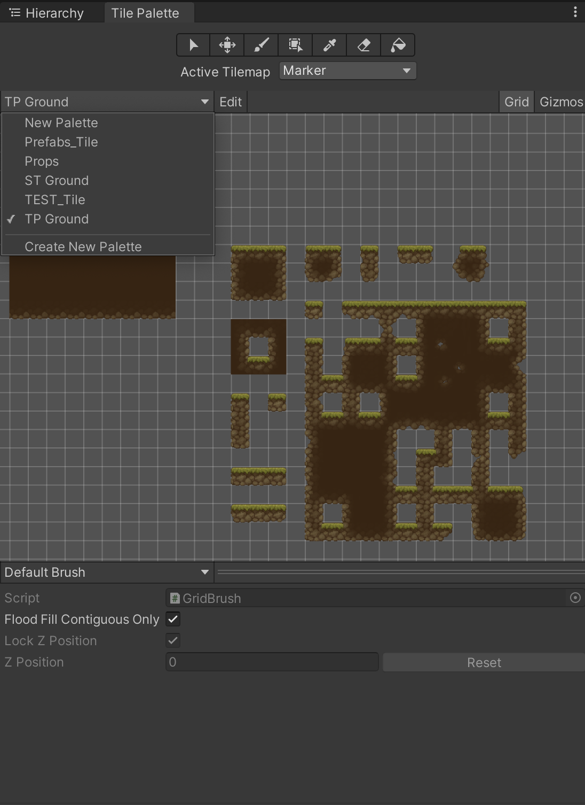
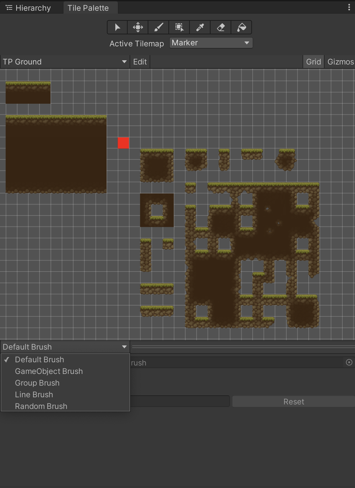

> # 러닝 씬 레벨 디자인

---

> ## 목차

0. 유니티 설치

2. 유니티 화면 소개

3. 지형지물 직접 만들어 보기

4. 배경 직접 만들어 보기

5. 몬스터 직접 만들어 보기

6. 개발 프로세스

---

> ### 0. 유니티 설치
1. Unityhub 다운
2. Gdrive 다운


> ### 1. 유니티 화면 소개 

#### 유니티 에디터 창


#### 씬뷰, 게임뷰
 
**씬뷰**
* 조작하는 방법
    1. 우클릭을 누르고 WASD 하면 자유시점이 된다.
    2. 요소를 더블클릭하면 요소를 선택할 수 있다.
    3. 3D & 2D 시점 전환
        | 3D | 2D |
        |---|---|
        |||

**게임뷰**
* 실제 게임 플레이에서 보여주게될 화면이다.
    
* 플레이 해보고 싶다면 
    1. 플레이
    2. 멈추기

* *주의할점! : 플레이 중에 씬뷰에 가서 뭔가를 조작할 수는 있지만 
플레이가 종료되면 여태 하던 작업이 사라지게 된다!!*

#### 하이럴키
* 현재 씬뷰에 배치되어 있는 모든 게임 오브젝트를 보여줍니다.
씬뷰의 모~든 요소와 1 대1 대응이 된다.

* 이 모든것을 "게임 오브젝트" 라고 부릅니다. 
1. 하이럴키에 있다면 "게임 오브젝트"
2. Project 에서 위치하게 된다면 "프리펩"

* 이 게임 오브젝트는 다른 게임 오브젝트를 감쌀 수도 있습니다.
    이러한 관계를 부모 자식 관계라고 말한다.

* 하이럴키는 정리를 잘해놓는게 좋다.
    씬에 존재하는 "겜옵" 를 넣을떄 그저 넣을 수도 있지만, 
    무질서하게 배치하는것 보다는 아무렴 그룹을 짓는게 좋지 않겠냐.

* 그런 의미에서 우리가 다뤄야 하는것은 오직 "Map" 이것만 다루시면 된다.
    


#### 인스펙터

* 이제 이 인스펙터에 뭔가 뭔가를 추가하게 된다면.
비주얼적으로, 동작 등등을 추가할 수 있는데

* 중요한것은 우리가 능동적으로 뭔가를 추가하지는 않을것이고,
우리 개발자가 만들어 놓은것을 직접 조작하시면 될것 같습니다.

#### 프로젝트 창

* 프로젝트는 우리 게임 폴더입니다.
우리 게임을 이루는 모든 자료들이 여기에 들어 있습니다.

* 주로 다루실 폴더는  Resources 입니다.

----

### 2. 지형지물 직접 만들어 보기

#### 타일맵


지형지물을 설치할때, 앞으로 우리는 픽셀 단위로 맵을 배치해 볼것입니다.





---

### 3. 배경 직접 만들어 보기


#### 용어 정리
**1. ParallexBack : 백그라운드**
```
Background_숫자_요소이름
* 숫자가 낮은 순서대로 앞에 그려질것이 됩니다.
```

**2. ParallexFront : 포어그라운드**
```
Forwardground_숫자_요소이름
* 숫자가 낮은 순서대로 앞에 그려질것이 됩니다.
```


#### 이미지 만들기


### 4. 몬스터 배치해보기

1. **Mob과 MobMoveData의 개수는 동일하게 1대1 대응이 된다.**
2. **"몇초동안 유지되도록"**, **"혹은 무한이 사라지지 말지 결정"**
3. **생성되는 위치와 사라지는 위치 결정**
    1. 생성위치 
        * `X : 가로위치, Y : 세로위치`
        * -12가 최고 오른쪽 이라는것을 명심해주시길 바랍니다
    2. -50가 사라지는 시점
        `X : 가로위치, Y : 세로위치`
        * -50이 사라지는 위치라고 명심해주시길 바랍니다.


---

1. 레벨 디자인
* 타일맵이 아닌것 : 격자모양 배치를 안해도 괜찮다.
    * 앞배경 & 뒷배경
    * Zone
   
1. 몬스터 

### 6. 개발 프로세스
    1. 기존에 있는걸 그대로 사용해도 괜찮다.
    2. 다만 없을수도 있을떄는 어떻게 해야하는거지?
        무언가 만들거나 추가를 헤야하 꼭!
        그럴떄 있어서 
        Resources -> GAME_포지션_레벨디자인_이름
        폴더 만들기 